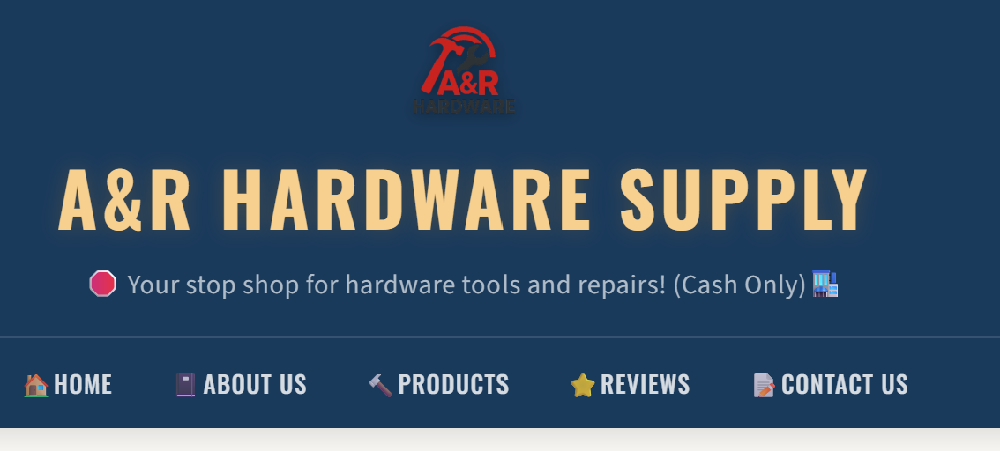

# A&R Hardware Supply 🔨

> A custom website built for a family-owned hardware store in Brooklyn, NY — crafted with care as a freelance web development project.

URL: https://arhardwaresupply.com/

---

## Description

A&R Hardware Supply is a multi-page business website for a local Brooklyn hardware store with over 20 years of experience. The site showcases the store's products, services, customer reviews, and contact information — giving the business a professional online presence to match its reputation in the community.

---

## Table of Contents

- [Description](#description)
- [Installation](#installation)
- [Usage](#usage)
- [Credits](#credits)
- [License](#license)
- [Badges](#badges)
- [Features](#features)
- [How to Contribute](#how-to-contribute)
- [Tests](#tests)

---

## Installation

No installation required. Visit the live site directly via URL in any modern web browser.

---

## Usage

Navigate through the site using the top navigation bar:

- **Home** — Storefront slideshow and owner introduction
- **About** — Store history, hours, and location
- **Products** — Browse the most popular tools and hardware items
- **Reviews** — Read what customers are saying on Google and Yelp
- **Contact** — Send a message directly to the owner via the contact form



---

## Credits

Sole developer — no collaborators.

---

## License

No license. All rights reserved.

---

## Badges


---

## Features

- 📸 Auto-advancing image slideshow with magnifier glass on the home page
- 🔨 Dynamic product cards loaded from a local JSON data file
- ⭐ Real customer reviews sourced from Google and Yelp
- 📝 Functional contact form powered by EmailJS — messages go straight to the owner
- 🌙 Light/dark mode toggle with persistent preference via localStorage
- 📱 Fully responsive layout across desktop, tablet, and mobile

---

## How to Contribute

```bash
# 1. Clone the repository
git clone https://github.com/your-username/hardware-hub.git

# 2. Create a new branch
git checkout -b feature/your-feature-name

# 3. Make your changes, then stage and commit
git add .
git commit -m "Add: description of your change"

# 4. Push your branch and open a Pull Request
git push origin feature/your-feature-name
```

---

## Tests

No automated tests at this time.